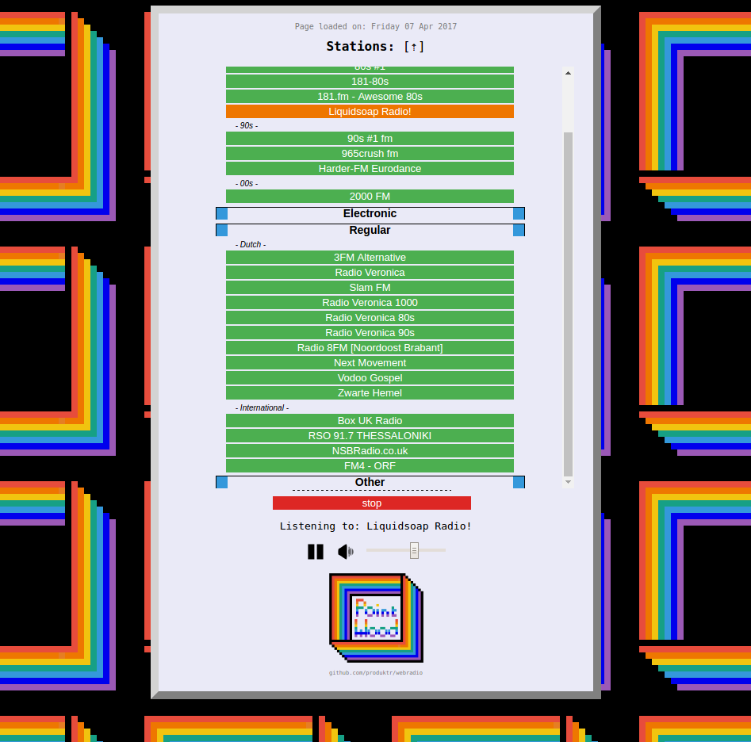

# Webradio
Simple php file webradio.  
Except image files, this README.md and the hls library all code must be kept in one single file (index.php contains all css/html/js/php).  

Why? Shits and giggles...  
Drawbacks? All of them... (more to load)

### How does it look

[See it in action](http://pointwood.pw/webradio)

### Stations
Add stations directly into index.php $stations object:  
    `groupname => [ station_name => [ url, init_volume, type ] ]`  

The page relies heavily on cookies to determine element visibility and to rember volume settings.  
Remember the page does not use ajax, so everytime a station is selected the page gets reloaded fully!  

### Hls type
https://github.com/dailymotion/hls.js is used to play stations using this method. Add 'hls' as type.  

### Oscilloscope visuals
Uses web audio api and canvas to create oscilliscope.  

Not all sources has the header Access-Control-Allow-Origin set correct.  
To circumvent CORS restrictions you could set up a reverse proxy:  

Apache 2 example:  
	`# Proxy for circumventing CORS restrictions (webradio)  
	ProxyPassMatch ^/c_cors/(.*)$ http://$1  
	Header set Access-Control-Allow-Origin "*"`  

Configuration (top of index file):  
	`define('C_CORS', true); // circumvent CORS (use proxy)`  
Set to false when not using a proxy  

### Mobile
Page is not ~really~ mobile friendly. Also audio only starts playing after the user clicks the play/pause button.  

